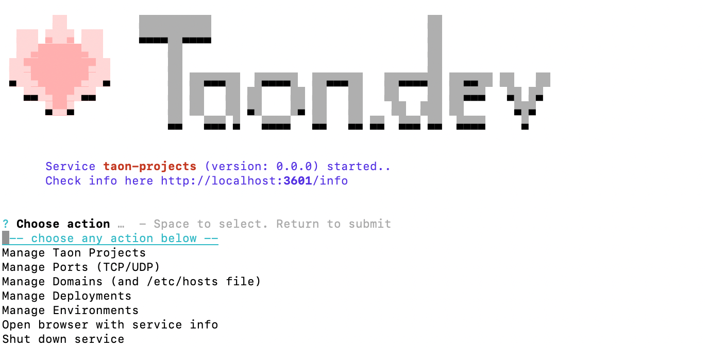

## Cloud-Service

Taon, out of the box, provides users with a local service for easy project/port/domain management and deployment. It also gives an insight into what the real bare-bones Taon Cloud service feels like. Essentially, *Taon Service* is the same as *Taon Cloud*.
 
 
By default, each Taon command checks if a working and healthy local Taon service is available. If not, a new terminal console inside the system starts with the Taon user-friendly UI console.

**Taon UI Console** – basically, it’s everything you would ever need for deploying and managing your remote projects through SSH. No need for a browser UI, no distractions, security concerns. 

## Behavior - on server vs on localhost
<table>
  <tr>
    <th style="font-weight: normal">Behavior - on server vs on localhost</th>
    <th><u>Localhost</u></th>
    <th><u>Cloud</u></th>
  </tr>
  <tr>
    <td><b>Enable/Disable Cloud</b></td>
    <td >
    - enable or disable possibility of deploying docker projects 
    - start/stop traefik and related services 
      
    </td>
    <td>
    - domains are secure with automatically generated ssl ceritifacte 
    </td>
  </tr>
  <tr>
    <td><b>Manage Taon Projects</b></td>
    <td  >
    - discover/view/add/edit projects for deployments  
    - create new project (in future - automatic domain purchase )  
    </td>
    <td><= same as on localhost</td>
  </tr>
  <tr>
    <td><b>Manage Deployments</b></td>
    <td  >
      - main place where you can specify quickly what to deploy and where 
      - deploy projects/artifacts 
      - deploy groups of projects/artifacts
    </td>
    <td><= same as on localhost</td>
  </tr>
  <tr>
    <td><b>Manage Domains (and /etc/hosts file)</b></td>
    <td>
      - test domains assigned to server with ping 
      - simulate fake domains based on /etc/host         
    </td>
    <td>
    - (in future) deep service integration with providers that will let you
      skip learning about redirecting/assigning domains 
    </td>
  </tr>
  <tr>
    <td><b>Manage Ports</b></td>
    <td >
      - assign automatically ports to projects when starting local build (no
      more --port needed, everything) 
      - project from same location use the same ports every time to avoid
      confusion 
      - for: projects, services, dockers
    </td>
    <td><= same as on localhost</td>
  </tr>
  
  <tr>
    <td><b>Manage Processes</b></td>
    <td   >
    - see processes realtime logs 
    - display log files
    </td>
    <td><= same as on localhost</td>
  </tr>

  <tr>
    <td><b>Manage Instances</b></td>
    <td   >
    - add/list/check/authenticated taon instances 
    - each taon instance can be connected to other taon instances     
    </td>
    <td><= same as on localhost</td>
  </tr>

  <tr>
    <td><b>Manage Scheduler</b></td>
    <td   >
    - Start deployment of specific project on specific hour 
    - Auto deploy after push to specific branch     
    </td>
    <td><= same as on localhost</td>
  </tr>

  <tr>
    <td><b>Settings</b></td>
    <td    >
      - setup password / 2fa authentication for server  
      - enable cloud optional container (etc. portainer) 
    </td>
    <td><= same as on localhost</td>
  </tr>
</table>
